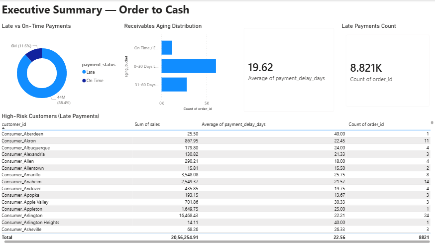
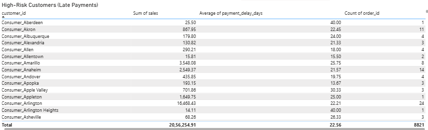
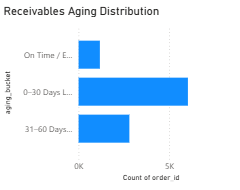
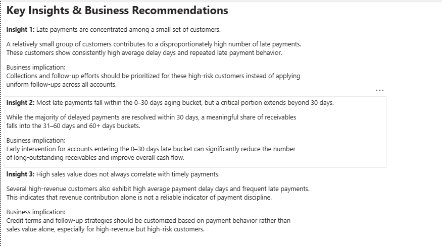

# 📊 Retail Cashflow Analytics — Order-to-Cash Project


## 🧠 Project Overview
This project demonstrates a complete **Order-to-Cash (O2C) analytics workflow** using Python and Jupyter Notebook.
The objective is to analyze retail transactions, simulate payment behavior, calculate payment delays,
and derive actionable insights related to receivables and cash flow performance.

This project mirrors real-world Accounts Receivable and finance analytics scenarios.

---

## 📋 Business Problem
Late customer payments negatively impact:
- Cash flow
- Working capital
- Financial planning

This analysis helps identify:
- Late vs on-time payments
- Receivables aging buckets
- High-risk customers for collections prioritization

> Note: The dataset does not include actual date fields.  
> Dates were **simulated** to demonstrate Order-to-Cash analytics logic.

---

## 📁 Project Structure

```
retail-cashflow-analytics/
├── data/                # Dataset
├── notebooks/           # Python analysis notebooks
├── sql/                 # SQL schema & analysis queries
├── screenshots/         # Dashboard screenshots
└── README.md
```


---

## 🛠 Tools & Technologies
- Python (Pandas, NumPy)
- Jupyter Notebook
- SQL (schema & business queries)
- Power BI (dashboard & insights)

---

## 🔍 Key Analytical Steps
1. Data cleaning and preprocessing  
2. Simulation of order and ship dates  
3. Creation of payment due dates and payment dates  
4. Calculation of payment delay days  
5. Classification of late vs on-time payments  
6. Receivables aging analysis  
7. Customer-level payment risk analysis  

---

## 📈 Sample Insights
- A small group of customers contributes to a large share of delayed payments
- Customers with high sales value are not always timely payers
- Aging buckets help prioritize collection efforts effectively

---

## 📸 Dashboard Preview






---

## 🚀 Next Steps
- Extend analysis with customer segmentation
- Add predictive modeling (optional)
- Build automated workflows / dashboards

---

## 👤 Author
**Nihma Shanavas**  
Data Analyst | Python | SQL | Power BI  
GitHub: https://github.com/nihma-2002
